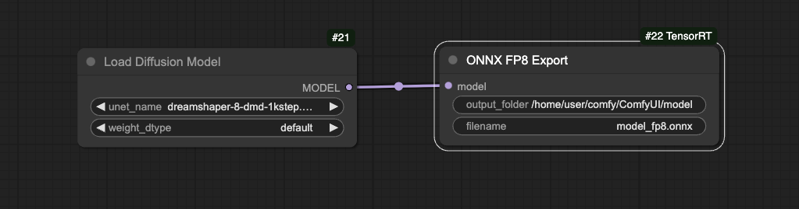
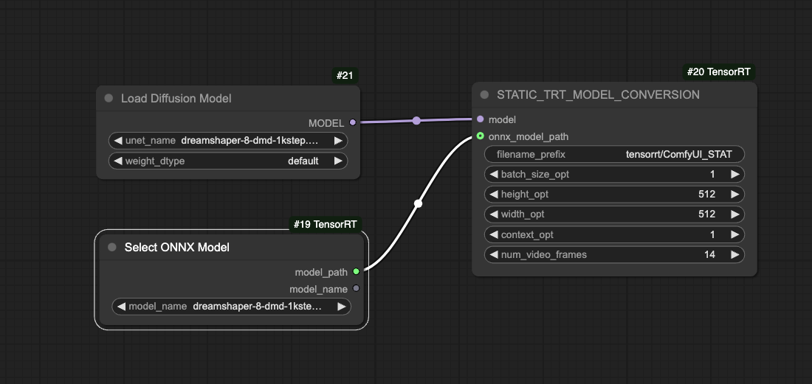

# ComfyUI/ComfyStream Real-Time SD1.5 + DMD + Depth ControlNet

- [Overview](#overview)
- [Install custom nodes](#install-custom-nodes)
- [Download models](#download-models)
- [Compile TensorRT engines](#compile-tensorrt-engines)
- [Use workflow](#use-workflow)
    - [ComfyUI](#comfyui)
    - [ComfyStream](#comfystream)
- [Ideas](#ideas)
- [Notes](#notes)

# Overview

This workflow consists of:

- Dreamshaper 8 for the base SD1.5 model.
- 1-step distilled (using [DMD](https://github.com/Zeqiang-Lai/OpenDMD)) UNet.
    - Compiled into a fp8 TensorRT engine.
- [TAESD](https://github.com/madebyollin/taesd) for the VAE.
    - Compiled using `torch.compile`.
- Depth ControlNet
    - Compiled using `torch.compile`.
- DepthAnythingV2
    - Compiled into a fp16 TensorRT engine.

This workflow has achieved an output FPS of ~14-15 for a video stream with an input FPS of 14fps using the [ComfyStream server + UI](https://github.com/yondonfu/comfystream) when testing with the following setup:

- OS: Ubuntu
- GPU: Nvidia RTX 4090
- Driver: 550.127.05
- CUDA: 12.5
torch: 2.5.1+cu121

The first few runs will be slower due to JIT compilation via `torch.compile`.

Check out some of the [ideas](#ideas) for enhancing and extending this workflow!

Check out some of the [notes](#notes) for thoughts regarding this workflow!

# Install custom nodes

## tensorrt

- [Repo](https://github.com/yondonfu/ComfyUI_TensorRT) (this is a fork of [the contentis fork](https://github.com/contentis/ComfyUI_TensorRT/tree/quantization) of [the original repo](https://github.com/comfyanonymous/ComfyUI_TensorRT) that supports fp8 quantization and processing ControlNet inputs)

```
cd custom_nodes
git clone -b quantization_with_controlnet_fixes https://github.com/yondonfu/ComfyUI_TensorRT.git
cd ComfyUI_TensorRT
pip install -r requirements.txt
```

## torch-compile

- [Repo](https://github.com/yondonfu/ComfyUI-Torch-Compile)

```
comfy node install comfyui-torch-compile
```

## depth-anything-tensorrt

- [Repo](https://github.com/yuvraj108c/ComfyUI-Depth-Anything-Tensorrt)

```
comfy node install depth-anything-tensorrt
```

# Download models

## dreamshaper-8

Download the dreamshaper-8 model weights [here](https://civitai.com/models/4384/dreamshaper) and copy into the `models/checkpoints` folder of your ComfyUI workspace.

## dreamshaper-8-dmd-1kstep

Download the dreamshaper-8-dmd-1kstep model weights [here](https://huggingface.co/aaronb/dreamshaper-8-dmd-1kstep) and copy into the `models/unet` folder of your ComfyUI workspace.

The original OpenDMD repo, which contains an open source implementation of the [DMD paper](https://arxiv.org/abs/2311.18828), can be found [here](https://github.com/Zeqiang-Lai/OpenDMD).

## depth-anything-v2

Download the model weights for the `_vits.onnx` version [here](https://huggingface.co/yuvraj108c/Depth-Anything-2-Onnx) and copy into the `custom_nodes/ComfyUI-Depth-Anything-Tensorrt` folder of your ComfyUI workspace. We will use these weights to build a TensorRT engine later on.

## control_v11f1p_sd15_depth_fp16

Download the model weights [here](https://huggingface.co/comfyanonymous/ControlNet-v1-1_fp16_safetensors) and copy into the `models/controlnet` folder of your ComfyUI workspace.

## TAESD

Download the model weights for [taesd_decoder.pth](https://github.com/madebyollin/taesd/blob/main/taesd_decoder.pth) and [taesd_encoder.pth](https://github.com/madebyollin/taesd/blob/main/taesd_encoder.pth) and copy into the `models/vae_approx` folder of your ComfyUI workspace.

# Compile TensorRT engines

## dreamshaper-8-dmd-1kstep TensorRT

In ComfyUI:

1. Generate fp8 ONNX weights for the `dreamshaper-8-dmd-1kstep` weights.



2. Compile a TensorRT engine using the fp8 ONNX weights.



## depth-anything-v2

Follow [these instructions](https://github.com/yuvraj108c/ComfyUI-Depth-Anything-Tensorrt?tab=readme-ov-file#%EF%B8%8F-building-tensorrt-engine) to compile a TensorRT engine.

For Step 2, make the following updates to `export_trt.py`:

- Set `trt_path` to `./depth_anything_v2_vits14-fp16.engine`
- Set `onnx_path` to `./depth_anything_v2_vits14.onnx`

# Use workflow

## ComfyUI

Start ComfyUI with the `--disable-cuda-malloc` flag which is required to avoid issues with the `torch.compile` configuration for the workflow.

Download [workflow.json](./workflow.json) and drag-and-drop it into ComfyUI.

## ComfyStream

Download [api-workflow.json](./api-workflow.json) and upload it when using the ComfyStream UI.

# Ideas

A couple of ideas to experiment with using this workflow as a base (note: in the long term, I suspect video models that are trained on actual videos to learn motion will yield better quality than stacking different techniques together with image models, so think of these as short-term experiments to squeeze as much juice as possible out of the open image models we already have):

Requires less coding:

- Use [ComfyUI-Background-Edit](https://github.com/yondonfu/ComfyUI-Background-Edit) to separate the background/foreground of each frame, diffuse the background and/or foreground for each frame separately and then composite them back together. For example, we could re-style the background and keep the foreground character or vice-versa.
- Use [SAM2](https://github.com/pschroedl/ComfyUI-SAM2-Realtime) to mask specific regions of frames and selectively diffuse those regions. For example, we could re-style a basketball in each frame, but keep everything else the same.
- Use a ControlNet with a different conditioning input. For example, we could use an OpenPose ControlNet and then pass in input video with a moving OpenPose skeleton.
- Use [RealTimeNodes](https://github.com/ryanontheinside/ComfyUI_RealTimeNodes) to control the parameter values in this workflow over time (i.e. change the text prompt over time, change the denoise level over time).

Requires more coding:

- Use the same scheduling/sampling for DMD as the [OpenDMD repo](https://github.com/Zeqiang-Lai/OpenDMD/blob/main/dmd/scheduling_dmd.py#L14).
- Use [DMD2](https://github.com/tianweiy/DMD2), which is supposed to be an improvement over the original DMD, for the UNet. The DMD2 repo contains pretrained weights using SDXL as the base model which might result in better quality outputs than the DMD weights which uses SD1.5 as the base model.
- Use additional speed up techniques found in [StreamDiffusion](https://github.com/cumulo-autumn/StreamDiffusion) outside of the stream batch (this workflow already uses a 1-step model so the stream batch technique shouldn't make a difference, but there may be additional techniques there that could offer speed gains).
- Use [TAESDV](https://github.com/madebyollin/taesdv), which supposedly can decode a continuous sequence of latents into a smoother sequence of frames than TAESD, for the VAE. 
- Use [TemporalNet](https://huggingface.co/CiaraRowles/TemporalNet2) as an additional ControlNet in the workflow and use the [optical flow](https://pytorch.org/vision/0.12/auto_examples/plot_optical_flow.html) for pairs of frames as the conditioning input to try to improve temporal conistency (i.e. reduce flickering, drastic frame-to-frame changes). In order to make this fast, we can use `torch.compile` to speed up the optical flow model (via a [custom node](https://github.com/yondonfu/ComfyUI-Torch-Compile/issues/1)).
- Use IP-Adapters to use an image prompt instead of text prompt to guide diffusion. In order to make this fast, we'd probably want to accelerate the IP-Adapter with something like `torch.compile`.

# Notes

**Why create this workflow instead of just using one of the StreamDiffusion custom nodes?**

The StreamDiffusion library is built on top of the `diffusers` library so any custom node that just wraps the library would not be immediately composable with ComfyUI nodes that work with the ComfyUI core diffusion nodes. As a result, you wouldn't be able to use the UI to do things like swap the sampler, ControlNets, VAEs, etc. without building additional nodes.

**How does the speed of diffusion in this workflow compare with StreamDiffusion?**

Since this workflow uses a 1-step distilled model and StreamDiffusion's stream batch technique only provides speed ups when the # of steps used by the model is > 1, diffusion for this particular model shouldn't be much slower than StreamDiffusion. However, since this workflow is only able to reach ~14fps on a Nvidia RTX 4090, there may be additional techniques used in StreamDiffusion that if adopted here could close the remaining speed gap.